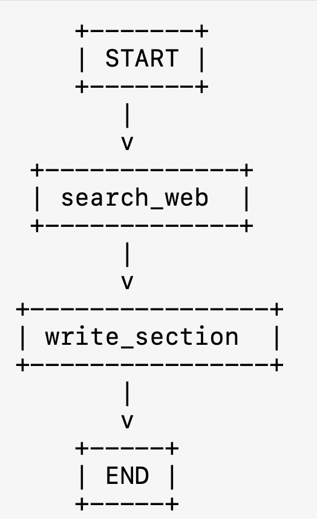
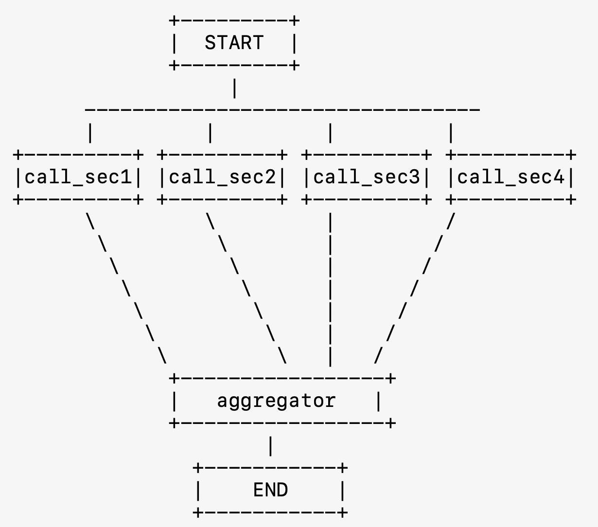

# H-GenAI 2025: SIA Partners, SFIL, AWS, Nvidia, MistralAI 🚀

## Présentation 📺

[The presentation deck](https://www.figma.com/deck/IcOXBsA3XaLusGuzAkZ9M9/Untitled?node-id=1-97&t=EYmtcmETtT7OwOMf-1)


---

## Table of Contents

- [Setup](#setup)
- [Installation & Running the Project](#installation--running-the-project)
- [Business Requirements](#business-requirements)
- [Technology Stack](#technology-stack)
- [Project Structure](#project-structure)
- [Key Features](#key-features)

---

## Setup

Before starting, add your API keys using the `env_template` file. Copy it to `.env` and place it in the `backend/` directory.

---

## Installation & Running the Project

### 1. Install Dependencies

Install all required Python packages with:

```bash
pip install -r requirements.txt
```

### 2. Run the Backend

Navigate to the backend folder and start the FastAPI server using Uvicorn:

```bash
cd backend/
uvicorn app:app --reload
```

### 3. Run the Frontend

Switch to the frontend directory and launch the Streamlit application:

```bash
cd ../frontend/
streamlit run main.py
```

---

## Business Requirements

The project is designed to generate comprehensive client profiles for local authorities. The sections to be covered include:

1. **General Overview** 🏙️  
   - **Demographics:** Population, area, density.  
   - **History:** Territorial reorganizations (e.g., districts, communities, metropolises).  
   - **Key Characteristics:** Role, economic, and administrative specifics.

2. **Key Contacts** 📞  
   - **Officials:** Main leaders (Mayor, Metropolitan/Community President, Directors).  
   - **Background:** Education and professional experience.  
   - **Roles:** Responsibilities and governance structure.

3. **2024 Budget** 💰  
   - **Overview:** Total approved budget.  
   - **Breakdown:** Operating vs. capital expenses.  
   - **Priorities:** Funding priorities and allocations.

4. **Financial Status** 📊  
   - **Indicators:** Debt, financial ratios (debt capacity, debt ratio).  
   - **Savings:** Gross savings and self-financing metrics.  
   - **Benchmarking:** Comparison with national/regional averages.

5. **Green Projects** 🌱  
   - **Investments:** Renewables (solar, wind, biomass).  
   - **Infrastructure:** Sustainable mobility (bike lanes, clean transport).  
   - **Urban Sustainability:** Energy efficiency initiatives (renovation, public lighting, water management).

6. **Social Projects** 🤝  
   - **Education:** Schools, colleges, vocational training.  
   - **Culture & Sports:** Facilities and infrastructure.  
   - **Inclusion:** Social policies and urban renewal strategies.

7. **Peer Comparison** 🔍  
   - **Financial Benchmarks:** Compare key financial and budget indicators with similar authorities.  
   - **Investments:** Analysis of similar eco-friendly and social transition projects in other regions.

---

## Technology Stack 🚀💻

### Language Models & AI Frameworks 🤖
- **nv-mistralai/mistral-nemo-12b-instruct (API)**
- **Nvidia NIM**

### Workflow & Orchestration 🔄
- **🦜⛓️‍💥Langchain** for multi-agent workflow orchestration

### Search & Retrieval 🔍
- **TavilySearch** for efficient data fetching

### Frontend & User Interface 🎨
- **Streamlit** for an interactive UI

### Backend & API Development ⚡
- **FastAPI** for building a scalable backend

### Deployment & Infrastructure (Planned) ☁️
- **AWS** (Amazon Web Services) – Consider using services such as AWS Lambda, EC2, or ECS for deployment
---

## Project Structure

```plaintext
project-root/
├── backend/
│   ├── app.py
│   ├── schemas.py
│   └── srcs/
│       ├── client_sheet_generator_agent.py
│       ├── prompts.py
│       └── web_search_agent.py
└── frontend/
    ├── DejaVuSans.ttf
    ├── generate_pdf.py
    ├── main.py
    ├── schemas.py
    └── utils.py
```

<div style="display: flex; justify-content: space-between; gap: 20px;">
  
  
</div>

---

## Key Features

- **Multi-Agent RAG Workflow:** Enhanced interactivity and functionality via Langchain’s multi-agent capabilities.
- **Efficient Data Retrieval:** TavilySearch provides quick and relevant data fetching.
- **Interactive UI:** Streamlit delivers a user-friendly interface for seamless interaction.
- **Scalable Deployment:** Future-proofed with plans for AWS integration to ensure scalability.
---
## Link Présentation + Demo 🍿

